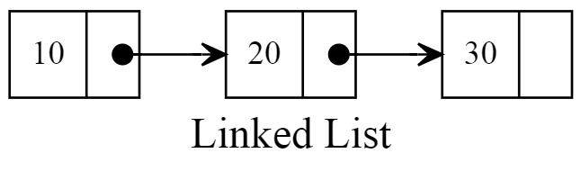

# Linked List in C
Linked List Data Structure implementation in C ( because why not )



For every new object in the linked list the program allocates an array of two items in memory:
```c
object = (long long int*) malloc(2 * sizeof(long long int));
object[0] = value;
object[1] = 0;
```
The first item in the object is the value, the second is the pointer to the next object.
If the pointer value is 0 it means that there's no more objects in the list after that one.

To link an object the program iters through all the items to find the last one ( he recognizes it because the pointer value is 0 ) and sets its pointer to the memory address of the new object.

( btw I also implemented this data structure [in asm8086](https://github.com/PoulDev/LinkedList-in-asm8086) )
